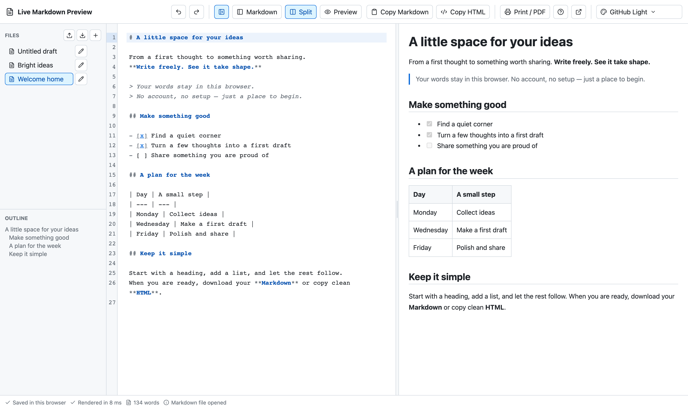
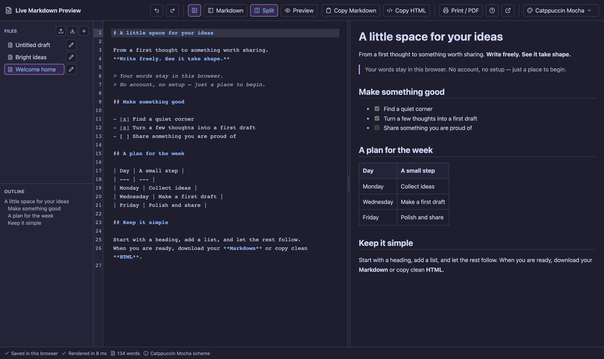

# Live Markdown Preview

**A little space for your ideas.** Write Markdown, watch it take shape, and keep your drafts in your browser.

[Open the editor](https://live-markdown-preview.igor-markin.workers.dev/)



*A first draft, a weekly plan, or a page worth sharing — source and preview, side by side.*

**Private Markdown workspace. Write locally, preview instantly, and copy clean HTML.** No account is required and document content is never sent to an application server. Keep several browser drafts, open or download `.md` files, and move from source to a reusable result without leaving the page.

<a href="https://www.producthunt.com/products/live-markdown-preview?embed=true&amp;utm_source=badge-featured&amp;utm_medium=badge&amp;utm_campaign=badge-live-markdown-preview" target="_blank" rel="noopener noreferrer"></a>

## Features

- Live Markdown preview rendered through a Web Worker.
- GitHub Flavored Markdown support for tables and task lists.
- Raw HTML support with DOMPurify sanitization, explicit URL hardening, and sanitized HTML copy.
- Local drafts, multiple files, and preferences stored in IndexedDB.
- Same-device draft conflict detection across tabs.
- Per-document working copies, conflict handling, and emergency recovery for multiple unsaved drafts.
- Outline, file sidebar, resizable editor/preview split, and persisted layout preferences.
- Open and download Markdown, copy Markdown or clean HTML code, use browser print / Save PDF, choose a color scheme, and open the Help dialog.
- Large document and large preview-output safeguards.

## Local-first model

- No backend, accounts, analytics, telemetry, or remote user-content storage.
- Markdown content is stored locally in the browser's IndexedDB.
- Preferences are stored locally and normalized on load.
- A short-lived `sessionStorage` backup is used only to recover unsaved edits if the page is hidden or reloaded before IndexedDB finishes saving.
- Clipboard and print actions use browser APIs and report recoverable errors when blocked.

## Color schemes

The editor includes 19 persisted color schemes. `GitHub Light` is the default light scheme, and `VS Code Dark+` is the default dark scheme.



*Make yourself at home. Switch to Catppuccin Mocha for a softer dark workspace, or choose another palette below.*

Available schemes: GitHub Light, GitHub Dark, Solarized Light, VS Code Dark+, One Dark Pro, Dracula, Catppuccin Mocha, Tokyo Night, Night Owl, Monokai, SynthWave '84, Material Palenight, Kanagawa, Rose Pine, Ayu Dark, Gruvbox Dark, Everforest Dark, Solarized Dark, and Nord.

## Security model

- Markdown is parsed in a Web Worker so expensive renders do not block the main UI thread.
- Raw HTML is sanitized before it reaches `dangerouslySetInnerHTML`.
- Scripts, event handlers, forms, embedded frames, SVG/MathML profiles, dangerous styles, and unsafe protocols are stripped.
- External preview links open in a new tab with `noopener noreferrer`; internal heading anchors stay in-page.
- Image URLs are restricted to same-origin paths or safe base64 raster data images.
- Production headers enforce CSP, `X-Content-Type-Options`, `Referrer-Policy`, `Permissions-Policy`, `frame-src 'none'`, `object-src 'none'`, `form-action 'none'`, and `frame-ancestors 'none'`.

## Tech stack

- Preact and Vite for the app shell.
- CodeMirror for the Markdown editor.
- unified, remark, and rehype for Markdown rendering.
- DOMPurify for preview sanitization.
- Vitest and Playwright for automated checks.

## Development

```bash
npm install
npm run dev
```

The dev server binds to `127.0.0.1`.

## Scripts

- `npm run dev` starts the Vite dev server.
- `npm run preview` builds the app and serves it with Wrangler.
- `npm run build` runs TypeScript checking and builds the app.
- `npm test` runs the Vitest suite once.
- `npm run test:watch` runs Vitest in watch mode.
- `npm run test:e2e` runs Playwright tests. The `pretest:e2e` script builds the app first.
- `npm run deploy` builds the app and deploys with Wrangler.

## Checks

```bash
npm run build
npm test
npm run test:e2e
```

Playwright starts `npm run preview -- --port 4173` at `http://127.0.0.1:4173` and does not reuse an existing server.

## Deployment

Cloudflare deployment security headers are defined in `public/_headers`. Vite preview is configured to serve matching security headers locally for e2e coverage.

The enforced policy includes CSP, `X-Content-Type-Options`, `Referrer-Policy`, and a restrictive `Permissions-Policy`.

Wrangler observability is disabled in `wrangler.jsonc` to keep the deployed app aligned with the no-telemetry local-first model.
